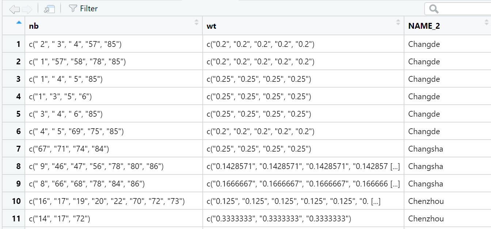
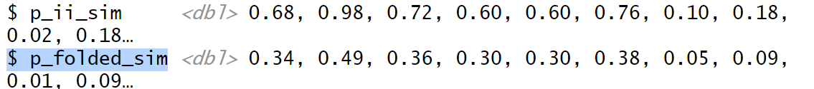

## **1. Setting the Analytical Toolls**

using sfdep here

```{r}
pacman::p_load(sf, sfdep, tmap, tidyverse)
```

## **2. Getting the Data Into R Environment**

```{r}
hunan <- st_read(dsn = "data/geospatial", 
                 layer = "Hunan") %>% 
  st_transform(crs = 32650)
```

```{r}
hunan2012 <- read_csv("data/aspatial/Hunan_2012.csv")
```

#### **Combining both data frame by using left join(main should be geospatial)**

```{r}
hunan_GDPPC<- left_join(hunan,hunan2012) %>%
  select(1:4, 7, 15)

```

## **3.Global Measures of Spatial Autocorrelation**

**Step 1: Deriving Queens's contiguity weights: sfdep methods**

```{r}
wm_q <- hunan_GDPPC %>%
  mutate(nb = st_contiguity(geometry),
         wt = st_weights(nb, style = "W"),
         .before = 1)

#before 1 will put newly mutated nb and wt in front of the orignial columns

```



can detect easily for row 1 has 5 neighbours and its respective weights

**Performing Global Moran'I permutation test**

Step1:

```{r}
set.seed(1234)
```

Step 2:

```{r}


global_moran_perm(wm_q$GDPPC,
                     wm_q$nb,
                     wm_q$wt,
                  nsim = 99)
```

Reject the null hypothesis if pvalue \< 2.2e-16, no need to explain further more

Need more detailed analysis for local

## **4. Local Measures of Spatial Autocorrelation**

```{r}
set.seed(1234)
```

```{r}
lisa <- wm_q %>% 
  mutate(local_moran = local_moran(
    GDPPC, nb, wt, nsim = 99),
         .before = 1) %>%
  unnest(local_moran)

glimpse(lisa)

#
```



#### 4.1 Preparing LISA map classes

#p_ii_sim helps to plot insignificant, not like automatically classified one

```{r}
lisa <- lisa %>%
  mutate(
    LISA_cluster = ifelse(
      p_ii_sim < 0.05,
      as.character(mean), 
      "Insignificant"),
    LISA_cluster = factor(
      LISA_cluster,
      levels = c("Insignificant", "Low-Low", "Low-High", "High-Low", "High-High")
    )
  )


```

```{r}
lisa_map <- tm_shape(lisa) + 
  tm_polygons(
    fill = "LISA_cluster",
    fill.scale = tm_scale_categorical(
      values = c(
        "grey80",      # Insignificant
        "blue",        # Low-Low
        "lightblue",   # Low-High
        "pink",        # High-Low
        "red"          # High-High
      )
    ),
    fill.legend = tm_legend(
      title = "LISA Cluster",
      position = tm_pos_in("left", "bottom"))
  ) +
  tm_borders() +
  tm_title("Local Moran's I Clusters (p < 0.05)")
lisa_map


#### 4.2 Plotting Moran scatterplot

lisa <- lisa %>%
  mutate(lag_GDPPC = st_lag(
    GDPPC, nb, wt),
    .before = 1) %>%
  unnest(lag_GDPPC)

```

```{r}
ggplot(data = lisa, 
       aes(x = GDPPC, 
           y = lag_GDPPC)) +
  geom_point() +
  geom_smooth(method = "lm", 
              se = FALSE, 
              color = "red") +
  labs(x = "GDPPC",
       y = "Spatial Lag of GDPPC",
       title = "Moran Scatterplot") +
  theme_minimal()
```

```{r}
ggplot(data = lisa, 
       aes(x = GDPPC, 
           y = lag_GDPPC, 
           color = mean)) +
  geom_point(size = 2) +
  geom_smooth(method = "lm", 
              se = FALSE, 
              color = "black") +
  geom_hline(yintercept=mean(lisa$lag_GDPPC), lty=2) + 
    geom_vline(xintercept=mean(lisa$GDPPC), lty=2) +
  scale_color_manual(
    values = c("High-High" = "red", 
               "Low-Low" = "blue",
               "Low-High" = "lightblue", 
               "High-Low" = "pink")) +
  labs(x = "GDPPC",
       y = "Spatial Lag of GDPPC",
       title = "Moran Scatterplot with LISA Quadrants") +
  theme_minimal()

```

```         
```
