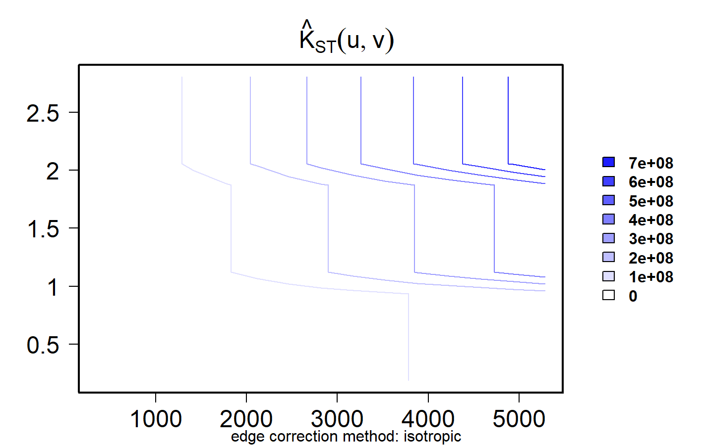

# **Problem Statement**

From **Jan 2024 to Jun 2025**, Singapore saw rapid growth of **food kiosks (SSIC 56123)**—small, takeaway-focused outlets with little or no seating. Their expansion around MRT nodes and malls can reshape micro-retail patterns, affect pedestrian space and curb logistics, and create pockets of under- or over-supply. This study uses ACRA registrations to reveal **where** and **when** kiosks emerge, how strongly they **cluster**, how activity **evolves over time**, and how locations relate to key **urban infrastructure**, to inform **evidence-based retail and land-use planning** in Singapore.

## **1. Objectives**

-   **Assess Clustering \***\
    Use spatial statistics to test whether kiosks are clustered or dispersed and at what spatial scales.

-   **Map Spatio-Temporal Distribution\***\
    Track when and where new 56123 kiosks entered (2024–Jun 2025) and highlight hotspot areas by month and subzone.

-   **Examine Infrastructure Proximity \***\
    Test whether kiosks concentrate near MRT stations(buffer analysis)

## **2. Data Wrangling**

```{r}

pacman::p_load(readr, dplyr, tidyr, stringr, lubridate,terra,spatstat, sparr, sf, stpp, tmap, units, httr, jsonlite, tidyverse,rvest, ggthemes, ployly, ggplot2)

```

### **2.1 Importing ACRA Data (Aspatial)**

```{r}
folder_path <- "data/aspatial/acra"
file_list <- list.files(path=folder_path,
                        pattern = "^ACRA*.*\\.csv$",
                        full.names = TRUE)

acra_data <- file_list %>%
  map_dfr(read_csv)
```

**Saving ACRA data**

```{r}
write_rds(acra_data,
          "data/rds/acra_data.rds") 
```

**Tidying ACRA data (56123 is for bubble tea shops)**

```{r}
### select target businesess, derive year, tidy postal code for geo coding and...
biz_56123 <- acra_data %>%
  select(1:24) %>%
  filter(primary_ssic_code == 56123) %>%
  rename(date = registration_incorporation_date) %>%
  mutate(date = as.Date(date),
         YEAR = year(date),
         MONTH_NUM = month(date),
         MONTH_ABBR = month(date, label = TRUE, abbr = TRUE)) %>%
  mutate(postal_code = str_pad(postal_code, width = 6, side = "left", pad = "0")) %>%
   filter((YEAR == 2024 & MONTH_NUM >= 1) | (YEAR == 2025 & MONTH_NUM <= 6))

```

```{r}

#|eval:false
#|include: false
#|echo:false
write_rds(biz_56123,
"data/rds/biz_56123.rds")

```

```{r}

biz_56123 <-
read_rds("data/rds/biz_56123.rds")

```

**Geocoding (for finding X,Y coordinates)**

```{r}
postcodes <- unique(biz_56123$postal_code)

url <- "https://onemap.gov.sg/api/common/elastic/search"  ##API without paying

found <- data.frame()
not_found <- data.frame(postcode = character())

for (pc in postcodes) {
  query <- list(
    searchVal = pc,
    returnGeom = "Y",
    getAddrDetails = "Y",
    pageNum = "1"
  )


###converting to data frame
res <- GET(url, query = query)
json <- content(res)

if (json$found != 0) {
  df <- as.data.frame(json$results, stringsAsFactors = FALSE)
  df$input_postcode <- pc
  found <- bind_rows(found, df)
  } else {
  not_found <- bind_rows(not_found, data.frame(postcode = pc))
  }
}

```

```{r}
found <- found %>%
  select(1:10)
```

Appending the location information (join it back with 56123 right one with new geo_coded postal_code

2 columns in meter, 2 columns in Lon and Lat

```{r}
biz_56123_join = biz_56123 %>%
   left_join(found,
             by = c('postal_code' = 'POSTAL'))
```

```{r}
write_rds(biz_56123_join, "data/rds/biz_56123_join.rds")
```

**Converting into SF data frame**

```{r}

biz_56123_sf <- st_as_sf(biz_56123_join, 
                         coords = c("X","Y"),
                         crs=3414) 
class(biz_56123_sf)

```

```{r}

#|eval:false
#|include: false
#|echo:false
# case-insensitive regex for trailing street-type words (and anything after them)
suffix_re <- "(?i)\\s+(ROAD|RD|STREET|ST|AVENUE|AVE|DRIVE|DR|LANE|LN|CLOSE|CL|CRESCENT|CRES|TERRACE|TERR|WALK|PLACE|PL|PARK|PK|HEIGHTS|HTS|LINK|VIEW|WAY|COURT|CT|CIRCUIT|CIR|RISE|GROVE|GARDENS|GDN)(\\s+.*)?$"

# create Zone from street_name (fallback to STREET_NAME if needed)
biz_56123_sf <- biz_56123_sf %>%
  mutate(
    street_raw = coalesce(street_name),
    Zone = street_raw %>%
      str_replace_all("_", " ") %>%  # tidy underscores
      str_squish() %>%               # trim extra spaces
      str_remove(suffix_re) %>%      # drop trailing street-type
      str_squish() %>%
      str_to_upper()                 # <-- UPPER CASE
  )

# quick check
biz_56123_sf %>% select(street_raw, Zone) %>% head()
```

```{r}
write_rds(biz_56123_sf, "data/rds/biz_56123_sf.rds")
```

### **2.2 Importing Geospatial Data**

```{r}
mpsz_sf <- st_read("data/geospatial/MasterPlan2019SubzoneBoundaryNoSeaKML.kml") %>%
  st_zm(drop = TRUE, what = "ZM") %>% st_transform(crs = 3414)
```

```{r}
extract_kml_field <- function(html_text, field_name) {
  if (is.na(html_text) || html_text == "") return(NA_character_)
  
  page <- read_html(html_text)
  rows <- page %>% html_elements("tr")
  
  value <- rows %>%
    keep(~ html_text2(html_element(.x, "th")) == field_name) %>%
    html_element("td") %>%
    html_text2()
  
  if (length(value) == 0) NA_character_ else value
}
```

```{r}
mpsz_sf <- mpsz_sf %>%
  mutate(
    REGION_N = map_chr(Description, extract_kml_field, "REGION_N"),
    PLN_AREA_N = map_chr(Description, extract_kml_field, "PLN_AREA_N"),
    SUBZONE_N = map_chr(Description, extract_kml_field, "SUBZONE_N"),
    SUBZONE_C = map_chr(Description, extract_kml_field, "SUBZONE_C")
  ) %>%
  select(-Name, -Description) %>%
  relocate(geometry, .after = last_col())
```

```{r}

mpsz_cl <- mpsz_sf %>%
  filter(SUBZONE_N != "SOUTHERN GROUP",
         PLN_AREA_N != "WESTERN ISLANDS",
         PLN_AREA_N != "NORTH-EASTERN ISLANDS")
```

```{r}
write_rds(mpsz_cl, 
          "data/rds/mpsz_cl.rds")
```

```{r}
st_crs(mpsz_cl) == st_crs(biz_56123_sf)
```

#### **Mapping the geospatial data sets**

```{r}
ggplot() +
  geom_sf(data = mpsz_cl, fill = "gray", color = "black", size = 0.2) +
  geom_sf(data = biz_56123_sf, color = "black", size = 1.2, alpha = 0.7) +
  labs(title = "Food Kiosks Across Singapore Subzones",
       subtitle = "All layers aligned to EPSG:3414 (SVY21)",
       caption = "Source: URA Master Plan & Data.gov.sg") +
  theme_minimal()
```

### **2.3 Importing MRT Data**

```{r}
mrt <- st_read("data/geospatial/LTAMRTStationExitKML.kml") %>%
  st_transform(crs = 3414)
```

```{r}
#|eval:false
#|echo:false
write_rds(mrt,
"data/rds/mrt.rds")

```

```{r}
mrt<-
read_rds("data/rds/mrt.rds")
```

#### **Mapping the geospatial data sets**

```{r}
ggplot() +
  geom_sf(data = mpsz_cl, fill = "gray", color = "black", size = 0.2) +
  geom_sf(data = mrt, color = "green", size = 1.2, alpha = 0.7) +
  labs(title = "MRT Exit Across Singapore Subzones",
       subtitle = "All layers aligned to EPSG:3414 (SVY21)",
       caption = "Source: URA Master Plan & Data.gov.sg") +
  theme_minimal()
```

## **3 Objective: Clustering Analysis**

```{r}
biz_56123_ppp <- as.ppp(biz_56123_sf)

```

```{r}
class(biz_56123_ppp)
```

```{r}
#| eval: false
summary(biz_56123_ppp)
```

#### **Creating *owin* object and combining point events**

```{r}
sg_owin <- as.owin(mpsz_cl)
class(sg_owin)
```

```{r}
biz56123_sg_ppp = biz_56123_ppp [sg_owin]
```

### **3.1 Clark-Evan Test with CSR for Nearest Neighbour Analysis**

```{r}
clarkevans.test(biz56123_sg_ppp,
                correction="none",
                clipregion="sg_owin",
                alternative=c("clustered"),
                method="MonteCarlo",
                nsim=99)

```

#### **Statistical conclusion**

-   Clark–Evans NN test: **R = 0.514** (well below 1), **p \< 2.2×10⁻¹⁶** → reject CSR; locations are **significantly clustered**.

    Food kiosks are **much closer together** than random—i.e., **strongly clustered**, not evenly spread across Singapore.

### **3.2 Kernel Density Method**

```{r}
biz56123sg_ppp_km <- rescale.ppp(biz56123_sg_ppp, 1000, "km")
```

```{r}
kde_biz56123_km <- density(biz56123sg_ppp_km,
                              sigma=bw.diggle,
                              edge=TRUE,
                              kernel="gaussian")
```

#### **Working with different automatic badwidth methods**

```{r}
bw.CvL(biz56123sg_ppp_km )
```

```{r}
bw.scott(biz56123sg_ppp_km)
```

```{r}
bw.ppl(biz56123sg_ppp_km)
```

```{r}
bw.diggle(biz56123sg_ppp_km)
```

```{r}
kde_biz56123sg.ppl <- density(biz56123sg_ppp_km, 
                               sigma=bw.ppl, 
                               edge=TRUE,
                               kernel="gaussian")
par(mfrow=c(1,2))
plot(kde_biz56123_km, main = "bw.diggle")
plot(kde_biz56123sg.ppl, main = "bw.ppl")
```

#### **Plotting cartographic quality KDE map**

```{r}
kde_biz56123sg_bw_terra <- rast(kde_biz56123_km)
class(kde_biz56123sg_bw_terra)
```

```{r}
kde_biz56123sg_bw_terra
```

```{r}
crs(kde_biz56123sg_bw_terra) <- "EPSG:3414"
kde_biz56123sg_bw_terra
```

```{r}
tm_shape(kde_biz56123sg_bw_terra) + 
  tm_raster(col.scale = 
              tm_scale_continuous(
                values = "viridis"),
            col.legend = tm_legend(
            title = "Density values",
            title.size = 0.7,
            text.size = 0.7,
            bg.color = "white",
            bg.alpha = 0.7,
            position = tm_pos_in(
              "right", "bottom"),
            frame = TRUE)) +
  tm_graticules(labels.size = 0.7) +
  tm_compass() +
  tm_layout(scale = 1.0)
```

**Insights:**

-   Clear **hotspots at major commercial/commuter nodes**—the **Downtown Core/CBD** and several **regional town centres** (e.g., Jurong East/West, Ang Mo Kio–Bishan, Sembawang, Punggol–Sengkang).

-   **Linear belts** of higher intensity align with **MRT corridors/interchange areas**, suggesting transit-oriented siting.

-   Peaks are **highly localized** (small bright cells) while the **mean surface is low**, indicating concentrated clusters rather than broad uniform coverage—**consistent with Clark-Evans result (R≈0.51)** that showed strong clustering.

### **3.3 First Order SPPA at the Planning Subzone Level (Sembawang, Ang Mo Kio & Bishan, Punggol & Sengkang, Downtown Core, Jurong West & Jurong East)**

```{r}
sbw <- mpsz_cl %>%
  filter(PLN_AREA_N %in% c( "SEMBAWANG"))

amk_bs <- mpsz_cl %>%
  filter(PLN_AREA_N %in% c("ANG MO KIO", "BISHAN"))

pg_sk<- mpsz_cl %>%
  filter(PLN_AREA_N %in% c("PUNGGOL","SENGKANG"))

dc<- mpsz_cl %>%
  filter(PLN_AREA_N %in% c("DOWNTOWN CORE"))

jw_je <- mpsz_cl %>%
  filter(PLN_AREA_N %in% c("JURONG WEST", "JURONG EAST"))
```

```{r}
sbw_owin = as.owin(sbw)
amk_bs_owin = as.owin(amk_bs)
pg_sk_owin = as.owin(pg_sk)
jw_je_owin = as.owin(jw_je)
dc_owin = as.owin(dc)
```

```{r}
biz56123_sbw_ppp = biz_56123_ppp [sbw_owin]
biz56123_amk_bs_ppp = biz_56123_ppp [amk_bs_owin]
biz56123_pg_sk_ppp = biz_56123_ppp [pg_sk_owin]
biz56123_jw_je_ppp = biz_56123_ppp [jw_je_owin]
biz56123_dc_ppp = biz_56123_ppp [dc_owin]
```

```{r}
biz56123_sbw_ppp.km = rescale.ppp(biz56123_sbw_ppp, 1000, "km")
biz56123_amk_bs_ppp.km = rescale.ppp(biz56123_amk_bs_ppp, 1000, "km")
biz56123_pg_sk_ppp.km = rescale.ppp(biz56123_pg_sk_ppp, 1000, "km")
biz56123_jw_je_ppp.km = rescale.ppp(biz56123_jw_je_ppp, 1000, "km")
biz56123_dc_ppp.km = rescale.ppp(biz56123_dc_ppp, 1000, "km")
```

```{r}
par(mfrow=c(2,3))
plot(unmark(biz56123_sbw_ppp.km ), 
  main="Sembawang")
plot(unmark(biz56123_amk_bs_ppp.km), 
  main="Ang Mo Kio & Bishan")
plot(unmark(biz56123_pg_sk_ppp.km), 
  main="Punggol & Sengkang")
plot(unmark(biz56123_jw_je_ppp.km), 
  main="Jurong West & Jurong East")
plot(unmark(biz56123_dc_ppp.km), 
  main="Downtown Core")
```

#### **Clark and Evans Test**

```{r}
clarkevans.test(biz56123_sbw_ppp,
                correction="none",
                clipregion=NULL,
                alternative=c("two.sided"),
                nsim=999)
```

#### **Computing KDE surfaces by planning area**

```{r}


ppps <- list(
  "Sembawang"                 = biz56123_sbw_ppp.km,
  "Ang Mo Kio & Bishan"       = biz56123_amk_bs_ppp.km,
  "Punggol & Sengkang"        = biz56123_pg_sk_ppp.km,
  "Jurong West & Jurong East" = biz56123_jw_je_ppp.km,
  "Downtown Core"             = biz56123_dc_ppp.km
     )

sigma_km <- 0.30
ims  <- lapply(ppps, function(pp) density(pp, sigma = sigma_km, edge = TRUE, kernel = "gaussian"))
zmax <- max(sapply(ims, function(im) max(im$v, na.rm = TRUE)))

par(mfrow = c(2,3), mar = c(1.2, 1.2, 3.2, 5.2))

# ensure zmax exists (common color scale)
if (!exists("zmax")) {
  zmax <- max(sapply(ims, function(im) max(im$v, na.rm = TRUE)))
}

for (i in seq_along(ims)) {
  plot(ims[[i]],
       main    = "",                 # we'll add title() after
       xlab    = "", ylab = "",
       axes    = FALSE, frame.plot = FALSE,
       ribbon  = TRUE,
       zlim    = c(0, zmax),
       ribargs = list(main = expression("Kiosks per km"^2)))  # legend label

  # 2-line panel title: top = unit, bottom = area name
  ttl <- bquote(atop(" ", .(names(ppps)[i])))
  title(ttl, cex.main = 1.05, line = 1.2)
}
```

```{r}
#| eval: false
#| include: false
#| echo: false

#original

ppps <- list(
  "Sembawang"                 = biz56123_sbw_ppp.km,
  "Ang Mo Kio & Bishan"       = biz56123_amk_bs_ppp.km,
  "Punggol & Sengkang"        = biz56123_pg_sk_ppp.km,
  "Jurong West & Jurong East" = biz56123_jw_je_ppp.km,
  "Downtown Core"             = biz56123_dc_ppp.km
     )

sigma_km <- 0.30
ims  <- lapply(ppps, function(pp) density(pp, sigma = sigma_km, edge = TRUE, kernel = "gaussian"))
zmax <- max(sapply(ims, function(im) max(im$v, na.rm = TRUE)))

#sigma_km <- 0.30
#ims <- lapply(ppps, function(pp) spatstat.core::density(pp, sigma = sigma_km, edge = TRUE, kernel = "gaussian"))
#zmax <- max(sapply(ims, function(im) max(im$v, na.rm = TRUE)))


par(mfrow = c(2,3), mar = c(1.2, 1.2, 2.8, 5.2))
par(mar = c(4,4,3.8,6))
plot(ims[[i]], main = "")
title(ttl, line = 1.2, cex.main = 1.05)

for (i in seq_along(ims)) {
  
  plot(ims[[i]],
       main    = "",
       xlab    = "", ylab = "",
       axes    = FALSE, frame.plot = FALSE,
       ribbon  = TRUE,
       zlim    = c(0, zmax),
       ribargs = list(main = " ")) 

ttl <- bquote(atop("Kiosks per km"^2, .(names(ppps)[i])))
3title(ttl, cex.main = 1.05, line = 1.2)

   }


```

### **3.4 Second-order Spatial Point Patterns Analysis**

***G Function Estimation (for Sembawang)***

```{r}
set.seed(1234)
```

```{r}

G_SBW = Gest(biz56123_sbw_ppp, correction = "border")


```

To confirm the observed spatial patterns above, a hypothesis test will be conducted. The hypothesis and test are as follows:

Ho = The distribution of food kiosks at Sembawang are randomly distributed.

H1= The distribution of food kiosks at Sembawang are not randomly distributed.

The null hypothesis will be rejected if p-value is smaller than alpha value of 0.001.

Monte Carlo test with G-function

```{r}
G_SBW.csr <- envelope(biz56123_sbw_ppp, Gest, nsim = 999)
```

```{r}
plot(G_SBW.csr)
```

***Pairwise L Function(Sembawang, Ang Mo Kio & Bishan, Punggol & Sengkang, Downtown Core, Jurong West & Jurong East)***

```{r}


L_sbw= Lest(biz56123_sbw_ppp, correction = "Ripley")
L_amk_bs= Lest(biz56123_amk_bs_ppp, correction = "Ripley")
L_pg_sk= Lest(biz56123_pg_sk_ppp, correction = "Ripley")
L_jw_je= Lest(biz56123_jw_je_ppp, correction = "Ripley")
L_dc= Lest(biz56123_dc_ppp, correction = "Ripley")


```

```{r}

set.seed(1234)
L_sbw.csr <- envelope(biz56123_sbw_ppp, Lest, 
                     nsim = 99, 
                     rank = 1, 
                    glocal=TRUE)


set.seed(1234)
L_amk_bs.csr <- envelope(biz56123_amk_bs_ppp, Lest, 
                     nsim = 99, 
                     rank = 1, 
                     glocal=TRUE)


set.seed(1234)
L_pg_sk.csr <- envelope(biz56123_pg_sk_ppp, Lest, 
                     nsim = 99, 
                     rank = 1, 
                     glocal=TRUE)


set.seed(1234)
L_jw_je.csr <- envelope(biz56123_jw_je_ppp, Lest, 
                     nsim = 99, 
                     rank = 1, 
                     glocal=TRUE)


set.seed(1234)
L_dc.csr <- envelope(biz56123_dc_ppp, Lest, 
                     nsim = 99, 
                     rank = 1, 
                     glocal=TRUE)


```

```{r}

library(ggplot2)
library(ggthemes)
library(plotly)

# ----- build the plot data/frame -----
title <- "Pairwise Distance: L function for Sembawang"

L_sbw_csr_df <- as.data.frame(L_sbw.csr)

colour <- c("#0D657D","#ee770d","#D3D3D3")

csr_plot <- ggplot(L_sbw_csr_df, aes(r, obs - r)) +
  geom_line(colour = "#4d4d4d") +
  geom_line(aes(y = theo - r), colour = "red", linetype = "dashed") +
  geom_ribbon(aes(ymin = lo - r, ymax = hi - r),
              alpha = 0.10, colour = "#91bfdb") +
  xlab("Distance r (m)") +
  ylab("L(r) - r") +
  geom_rug(data = L_sbw_csr_df[L_sbw_csr_df$obs >  L_sbw_csr_df$hi,], sides = "b", colour = colour[1]) +
  geom_rug(data = L_sbw_csr_df[L_sbw_csr_df$obs <  L_sbw_csr_df$lo,], sides = "b", colour = colour[2]) +
  geom_rug(data = L_sbw_csr_df[L_sbw_csr_df$obs >= L_sbw_csr_df$lo &
                               L_sbw_csr_df$obs <= L_sbw_csr_df$hi,], sides = "b", colour = colour[3]) +
  theme_tufte() +
  ggtitle(title)

text1 <- "Significant clustering"
text2 <- "Significant segregation"
text3 <- "Not significant clustering/segregation"

# ----- conditional labelling of the rug traces -----
if (nrow(L_sbw_csr_df[L_sbw_csr_df$obs > L_sbw_csr_df$hi,]) == 0) {
  if (nrow(L_sbw_csr_df[L_sbw_csr_df$obs < L_sbw_csr_df$lo,]) == 0) {

    p <- ggplotly(csr_plot, dynamicTicks = TRUE) |>
      style(text = text3, traces = 4) |>
      layout(xaxis = list(rangeslider = list(visible = TRUE)))

  } else if (nrow(L_sbw_csr_df[L_sbw_csr_df$obs >= L_sbw_csr_df$lo &
                               L_sbw_csr_df$obs <= L_sbw_csr_df$hi,]) == 0) {

    p <- ggplotly(csr_plot, dynamicTicks = TRUE) |>
      style(text = text2, traces = 4) |>
      layout(xaxis = list(rangeslider = list(visible = TRUE)))

  } else {

    p <- ggplotly(csr_plot, dynamicTicks = TRUE) |>
      style(text = text2, traces = 4) |>
      style(text = text3, traces = 5) |>
      layout(xaxis = list(rangeslider = list(visible = TRUE)))
  }

} else if (nrow(L_sbw_csr_df[L_sbw_csr_df$obs < L_sbw_csr_df$lo,]) == 0) {

  if (nrow(L_sbw_csr_df[L_sbw_csr_df$obs >= L_sbw_csr_df$lo &
                        L_sbw_csr_df$obs <= L_sbw_csr_df$hi,]) == 0) {

    p <- ggplotly(csr_plot, dynamicTicks = TRUE) |>
      style(text = text1, traces = 4) |>
      layout(xaxis = list(rangeslider = list(visible = TRUE)))

  } else {

    p <- ggplotly(csr_plot, dynamicTicks = TRUE) |>
      style(text = text1, traces = 4) |>
      style(text = text3, traces = 5) |>
      layout(xaxis = list(rangeslider = list(visible = TRUE)))
  }

} else {

  p <- ggplotly(csr_plot, dynamicTicks = TRUE) |>
    style(text = text1, traces = 4) |>
    style(text = text2, traces = 5) |>
    style(text = text3, traces = 6) |>
    layout(xaxis = list(rangeslider = list(visible = TRUE)))
}

p  # print the plotly object

#Hiding the code for the rest
```

**Insights:**

-   The black curve L(r) − r L(r) is \> 0 across the distance range → food kiosks in Sembawang tend to aggregate rather than spread evenly.

-   Statistically significant clustering: The curve lies above the global CSR envelope from approximately r≈0 meters to about 600 meters.

-   This clustering aligns with localized commercial hubs, high foot traffic areas such as Bukit Canberra Hawker Centre, and community facilities in Sembawang

```{r}
#| echo: false 
library(ggplot2)
library(ggthemes)
library(plotly)

title <- "Pairwise Distance: L function for Ang Mo Kio and Bishan"

L_amk_bs_df <- as.data.frame(L_amk_bs.csr)

colour <- c("#0D657D","#ee770d","#D3D3D3")

csr_plot <- ggplot(L_amk_bs_df, aes(x = r, y = obs - r)) +
  geom_line(colour = "#4d4d4d") +
  geom_line(aes(y = theo - r), colour = "red", linetype = "dashed") +
  geom_ribbon(aes(ymin = lo - r, ymax = hi - r),
              alpha = 0.10, fill = "#91bfdb") +
  xlab("Distance r (m)") +
  ylab("L(r) - r") +
  geom_rug(data = L_amk_bs_df[L_amk_bs_df$obs >  L_amk_bs_df$hi,], sides = "b", colour = colour[1]) +
  geom_rug(data = L_amk_bs_df[L_amk_bs_df$obs <  L_amk_bs_df$lo,], sides = "b", colour = colour[2]) +
  geom_rug(data = L_amk_bs_df[L_amk_bs_df$obs >= L_amk_bs_df$lo & L_amk_bs_df$obs <= L_amk_bs_df$hi,],
           sides = "b", colour = colour[3]) +
  theme_tufte() +
  ggtitle(title)

text1 <- "Significant clustering"
text2 <- "Significant segregation"
text3 <- "Not significant clustering/segregation"

# ---- replace rangeslider() with layout(...rangeslider=...) ----
if (nrow(L_amk_bs_df[L_amk_bs_df$obs > L_amk_bs_df$hi,]) == 0) {

  if (nrow(L_amk_bs_df[L_amk_bs_df$obs < L_amk_bs_df$lo,]) == 0) {
    p <- ggplotly(csr_plot, dynamicTicks = TRUE) %>%
      style(text = text3, traces = 4) %>%
      layout(xaxis = list(rangeslider = list(visible = TRUE)))

  } else if (nrow(L_amk_bs_df[L_amk_bs_df$obs >= L_amk_bs_df$lo &
                              L_amk_bs_df$obs <= L_amk_bs_df$hi,]) == 0) {
    p <- ggplotly(csr_plot, dynamicTicks = TRUE) %>%
      style(text = text2, traces = 4) %>%
      layout(xaxis = list(rangeslider = list(visible = TRUE)))

  } else {
    p <- ggplotly(csr_plot, dynamicTicks = TRUE) %>%
      style(text = text2, traces = 4) %>%
      style(text = text3, traces = 5) %>%
      layout(xaxis = list(rangeslider = list(visible = TRUE)))
  }

} else if (nrow(L_amk_bs_df[L_amk_bs_df$obs < L_amk_bs_df$lo,]) == 0) {

  if (nrow(L_amk_bs_df[L_amk_bs_df$obs >= L_amk_bs_df$lo &
                       L_amk_bs_df$obs <= L_amk_bs_df$hi,]) == 0) {
    p <- ggplotly(csr_plot, dynamicTicks = TRUE) %>%
      style(text = text1, traces = 4) %>%
      layout(xaxis = list(rangeslider = list(visible = TRUE)))

  } else {
    p <- ggplotly(csr_plot, dynamicTicks = TRUE) %>%
      style(text = text1, traces = 4) %>%
      style(text = text3, traces = 5) %>%
      layout(xaxis = list(rangeslider = list(visible = TRUE)))
  }

} else {

  p <- ggplotly(csr_plot, dynamicTicks = TRUE) %>%
    style(text = text1, traces = 4) %>%
    style(text = text2, traces = 5) %>%
    style(text = text3, traces = 6) %>%
    layout(xaxis = list(rangeslider = list(visible = TRUE)))
}

p   # render the plotly object

```

**Insights:**

-   The curve L(r) − r is greater than 0 throughout the analyzed range, indicating that food kiosks in Ang Mo Kio and Bishan are not distributed evenly, but instead exhibit a tendency to aggregate.

-   Statistically significant clustering: The curve sits above the global CSR envelope from r≈0 to about 1180 meters, demonstrating strong clustering at these spatial scales.

-   Ang Mo Kio and Bishan: **Approximately 90% of the studied distance range (0–1100 m out of 0–1180 m) shows significant clustering of kiosks.**

```{r}
#| echo: false 
library(ggplot2)
library(ggthemes)
library(plotly)

title <- "Pairwise Distance: L function for Punggol and Sengkang"

L_pg_sk_df <- as.data.frame(L_pg_sk.csr)

colour <- c("#0D657D","#ee770d","#D3D3D3")

csr_plot <- ggplot(L_pg_sk_df, aes(x = r, y = obs - r)) +
  geom_line(colour = "#4d4d4d") +
  geom_line(aes(y = theo - r), colour = "red", linetype = "dashed") +
  geom_ribbon(aes(ymin = lo - r, ymax = hi - r),
              alpha = 0.10, fill = "#91bfdb") +
  xlab("Distance r (m)") +
  ylab("L(r) - r") +
  geom_rug(data = subset(L_pg_sk_df, obs >  hi), sides = "b", colour = colour[1]) +
  geom_rug(data = subset(L_pg_sk_df, obs <  lo), sides = "b", colour = colour[2]) +
  geom_rug(data = subset(L_pg_sk_df, obs >= lo & obs <= hi), sides = "b", colour = colour[3]) +
  theme_tufte() +
  ggtitle(title)

text1 <- "Significant clustering"
text2 <- "Significant segregation"
text3 <- "Not significant clustering/segregation"

# ---- replace rangeslider() with layout(...rangeslider=...) ----
if (nrow(subset(L_pg_sk_df, obs > hi)) == 0) {

  if (nrow(subset(L_pg_sk_df, obs < lo)) == 0) {
    p <- ggplotly(csr_plot, dynamicTicks = TRUE) %>%
      style(text = text3, traces = 4) %>%
      layout(xaxis = list(rangeslider = list(visible = TRUE)))

  } else if (nrow(subset(L_pg_sk_df, obs >= lo & obs <= hi)) == 0) {
    p <- ggplotly(csr_plot, dynamicTicks = TRUE) %>%
      style(text = text2, traces = 4) %>%
      layout(xaxis = list(rangeslider = list(visible = TRUE)))

  } else {
    p <- ggplotly(csr_plot, dynamicTicks = TRUE) %>%
      style(text = text2, traces = 4) %>%
      style(text = text3, traces = 5) %>%
      layout(xaxis = list(rangeslider = list(visible = TRUE)))
  }

} else if (nrow(subset(L_pg_sk_df, obs < lo)) == 0) {

  if (nrow(subset(L_pg_sk_df, obs >= lo & obs <= hi)) == 0) {
    p <- ggplotly(csr_plot, dynamicTicks = TRUE) %>%
      style(text = text1, traces = 4) %>%
      layout(xaxis = list(rangeslider = list(visible = TRUE)))

  } else {
    p <- ggplotly(csr_plot, dynamicTicks = TRUE) %>%
      style(text = text1, traces = 4) %>%
      style(text = text3, traces = 5) %>%
      layout(xaxis = list(rangeslider = list(visible = TRUE)))
  }

} else {

  p <- ggplotly(csr_plot, dynamicTicks = TRUE) %>%
    style(text = text1, traces = 4) %>%
    style(text = text2, traces = 5) %>%
    style(text = text3, traces = 6) %>%
    layout(xaxis = list(rangeslider = list(visible = TRUE)))
}

p  # render the interactive plot

```

**Insights:**

-   The curve **L(r) − r** remains above zero throughout most distances, confirming that food kiosks in Punggol and Sengkang tend to aggregate.

-   Statistically significant clustering occurs over several distinct distance intervals where the blue line (significant clustering indicator) appears: approximately 0–420 m, 500 -540 m, above 1100m.

-   These on/off clustering patterns suggest Food Kiosks hotspots spaced by areas of lower kiosk density, possibly reflecting residential clusters and commercial centers separated by less active zones.

```{r}
#| echo: false 
library(ggplot2)
library(ggthemes)
library(plotly)

title <- "Pairwise Distance: L function for Jurong West and Jurong East"

L_jw_je_df <- as.data.frame(L_jw_je.csr)

colour <- c("#0D657D","#ee770d","#D3D3D3")

csr_plot <- ggplot(L_jw_je_df, aes(x = r, y = obs - r)) +
  geom_line(colour = "#4d4d4d") +
  geom_line(aes(y = theo - r), colour = "red", linetype = "dashed") +
  geom_ribbon(aes(ymin = lo - r, ymax = hi - r),
              alpha = 0.10, fill = "#91bfdb") +
  xlab("Distance r (m)") +
  ylab("L(r) - r") +
  geom_rug(data = subset(L_jw_je_df, obs >  hi), sides = "b", colour = colour[1]) +
  geom_rug(data = subset(L_jw_je_df, obs <  lo), sides = "b", colour = colour[2]) +
  geom_rug(data = subset(L_jw_je_df, obs >= lo & obs <= hi), sides = "b", colour = colour[3]) +
  theme_tufte() +
  ggtitle(title)

text1 <- "Significant clustering"
text2 <- "Significant segregation"
text3 <- "Not significant clustering/segregation"

# ---- replace rangeslider() with layout(...rangeslider=...) ----
if (nrow(subset(L_jw_je_df, obs > hi)) == 0) {

  if (nrow(subset(L_jw_je_df, obs < lo)) == 0) {
    p <- ggplotly(csr_plot, dynamicTicks = TRUE) %>%
      style(text = text3, traces = 4) %>%
      layout(xaxis = list(rangeslider = list(visible = TRUE)))

  } else if (nrow(subset(L_jw_je_df, obs >= lo & obs <= hi)) == 0) {
    p <- ggplotly(csr_plot, dynamicTicks = TRUE) %>%
      style(text = text2, traces = 4) %>%
      layout(xaxis = list(rangeslider = list(visible = TRUE)))

  } else {
    p <- ggplotly(csr_plot, dynamicTicks = TRUE) %>%
      style(text = text2, traces = 4) %>%
      style(text = text3, traces = 5) %>%
      layout(xaxis = list(rangeslider = list(visible = TRUE)))
  }

} else if (nrow(subset(L_jw_je_df, obs < lo)) == 0) {

  if (nrow(subset(L_jw_je_df, obs >= lo & obs <= hi)) == 0) {
    p <- ggplotly(csr_plot, dynamicTicks = TRUE) %>%
      style(text = text1, traces = 4) %>%
      layout(xaxis = list(rangeslider = list(visible = TRUE)))

  } else {
    p <- ggplotly(csr_plot, dynamicTicks = TRUE) %>%
      style(text = text1, traces = 4) %>%
      style(text = text3, traces = 5) %>%
      layout(xaxis = list(rangeslider = list(visible = TRUE)))
  }

} else {

  p <- ggplotly(csr_plot, dynamicTicks = TRUE) %>%
    style(text = text1, traces = 4) %>%
    style(text = text2, traces = 5) %>%
    style(text = text3, traces = 6) %>%
    layout(xaxis = list(rangeslider = list(visible = TRUE)))
}

p  # render the interactive plot

```

**Insights:**

-   The curve **L(r) − r** rises above zero and the CSR envelope, indicating aggregation of food kiosks in Jurong West and Jurong East.

-   Statistically significant clustering (as shown by the continuous blue bar) is observed primarily at larger distances, from roughly 1100 m up to the maximum studied distance of 1800 m.

-   There is an "off" period at lower distances (from 0 to \~1100 m), where clustering is not statistically significant.

-   This pattern suggests kiosk clusters occur at broader spatial scales in Jurong, likely reflecting a few major commercial hubs, shopping precincts, or transport interchanges separated by less dense areas.

```{r}
#| echo: false 
library(ggplot2)
library(ggthemes)
library(plotly)

title <- "Pairwise Distance: L function for Downtown Core"

L_dc_df <- as.data.frame(L_dc.csr)

colour <- c("#0D657D","#ee770d","#D3D3D3")

csr_plot <- ggplot(L_dc_df, aes(x = r, y = obs - r)) +
  geom_line(colour = "#4d4d4d") +
  geom_line(aes(y = theo - r), colour = "red", linetype = "dashed") +
  geom_ribbon(aes(ymin = lo - r, ymax = hi - r),
              alpha = 0.10, fill = "#91bfdb") +
  xlab("Distance r (m)") +
  ylab("L(r) - r") +
  geom_rug(data = subset(L_dc_df, obs >  hi), sides = "b", colour = colour[1]) +
  geom_rug(data = subset(L_dc_df, obs <  lo), sides = "b", colour = colour[2]) +
  geom_rug(data = subset(L_dc_df, obs >= lo & obs <= hi), sides = "b", colour = colour[3]) +
  theme_tufte() +
  ggtitle(title)

text1 <- "Significant clustering"
text2 <- "Significant segregation"
text3 <- "Not significant clustering/segregation"

# ---- replace rangeslider() with layout(...rangeslider=...) ----
if (nrow(subset(L_dc_df, obs > hi)) == 0) {

  if (nrow(subset(L_dc_df, obs < lo)) == 0) {
    p <- ggplotly(csr_plot, dynamicTicks = TRUE) %>%
      style(text = text3, traces = 4) %>%
      layout(xaxis = list(rangeslider = list(visible = TRUE)))

  } else if (nrow(subset(L_dc_df, obs >= lo & obs <= hi)) == 0) {
    p <- ggplotly(csr_plot, dynamicTicks = TRUE) %>%
      style(text = text2, traces = 4) %>%
      layout(xaxis = list(rangeslider = list(visible = TRUE)))

  } else {
    p <- ggplotly(csr_plot, dynamicTicks = TRUE) %>%
      style(text = text2, traces = 4) %>%
      style(text = text3, traces = 5) %>%
      layout(xaxis = list(rangeslider = list(visible = TRUE)))
  }

} else if (nrow(subset(L_dc_df, obs < lo)) == 0) {

  if (nrow(subset(L_dc_df, obs >= lo & obs <= hi)) == 0) {
    p <- ggplotly(csr_plot, dynamicTicks = TRUE) %>%
      style(text = text1, traces = 4) %>%
      layout(xaxis = list(rangeslider = list(visible = TRUE)))

  } else {
    p <- ggplotly(csr_plot, dynamicTicks = TRUE) %>%
      style(text = text1, traces = 4) %>%
      style(text = text3, traces = 5) %>%
      layout(xaxis = list(rangeslider = list(visible = TRUE)))
  }

} else {

  p <- ggplotly(csr_plot, dynamicTicks = TRUE) %>%
    style(text = text1, traces = 4) %>%
    style(text = text2, traces = 5) %>%
    style(text = text3, traces = 6) %>%
    layout(xaxis = list(rangeslider = list(visible = TRUE)))
}

p  # render the interactive plot

```

**Insights:**

-   The curve **L(r) − r stays positive** from \~0 to \~750 m ⇒ kiosks tend to be **aggregated rather than evenly spaced**.

-   However, the observed curve **remains inside the CSR envelope across the whole range** (does **not** exceed the upper envelope).\
    ⇒ **No statistically significant departure from CSR** at the tested alpha (i.e., **clustering is not significant** under the global envelope test).

## **4. Objective: Map Spatio-Temporal Distribution**

```{r}
month_seq <- seq(as.Date("2024-01-01"), as.Date("2025-06-01"), by = "month")

df_month <- biz_56123_sf %>%
  filter(date >= as.Date("2024-01-01"),
         date <= as.Date("2025-06-30")) %>%
  mutate(MONTH_START = floor_date(date, "month"),
         MONTH_YR    = factor(format(MONTH_START, "%b-%Y"),
                              levels = format(month_seq, "%b-%Y"))) %>%
  count(MONTH_YR, name = "registrations") %>%
  complete(MONTH_YR, fill = list(registrations = 0)) %>%
  arrange(MONTH_YR)

y_max <- max(df_month$registrations, na.rm = TRUE) * 1.10

p_month_bar <- ggplot(df_month, aes(x = MONTH_YR, y = registrations, group = 1)) +
  geom_col(fill = "lightblue") +
  geom_text(aes(label = registrations), vjust = -0.5, size = 3.5) +
  geom_line(color = "red", linewidth = 1) +      # green trend line
  geom_point(color = "red") +                    # green points (optional)
  labs(
    title = "New Food Kiosks by Month (Jan 2024 – Jun 2025)",
    x = "Month", y = "Registrations"
  ) +
  theme_minimal() +
  theme(
    plot.title = element_text(hjust = 0.5),
    axis.text.x = element_text(angle = 45, hjust = 1)
  ) +
  expand_limits(y = y_max)

p_month_bar


```

**Insights:**

In early 2024, new food kiosk registrations in Singapore fluctuated but generally trended higher into 2025, peaking at 41 in May 2025. Noteworthy surges occurred in October 2024 and the first half of 2025, indicating increasing interest and market opportunity. Overall, the sector saw strong, sustained growth from late 2024 to mid-2025, reflecting rising entrepreneur interest and possibly favorable market or policy conditions.

```{r}
sg_poly_32748 <- mpsz_cl %>%
  st_make_valid() %>%
  st_union() %>%                  
  st_transform(32748)

sg_owin <- as.owin(sg_poly_32748)
```

```{r}
biz_56123_sf32748 <- biz_56123_sf %>%
  st_zm(drop = TRUE, what = "ZM") %>%
  st_transform(32748)


```

```{r}
biz_56123_sf32748 <- biz_56123_sf32748  %>% 
  mutate(DayofYear = yday(date)) %>%
  mutate(Month_num = month(date)) %>%
  mutate(Month_fac = month(date, 
                           label = TRUE, 
                           abbr = FALSE))
```

### **4.1 Visualising geographic distribution of New Food Kiosks by month**

```{r}
#| fig-width: 8
#| fig-height: 8
tm_shape(sg_poly_32748 )+
  tm_polygons() +
tm_shape(biz_56123_sf32748 ) +
  tm_dots(size = 0.08, col = "black") +
tm_facets(by="Month_fac", 
            free.coords=FALSE, 
            drop.units = TRUE)
```

### **4.2 Computing Spatio-temporal Point Patterns Analysis: stpp methods**

```{r}
biz_56123_stpp <- biz_56123_sf %>% 
  mutate(
    DayofYear = yday(date),
    Month_num = month(date),
    Month_fac = month(date, label = TRUE, abbr = FALSE),
    # DD
    x = st_coordinates(geometry)[, 1],
    y = st_coordinates(geometry)[, 2]
  ) %>%
  distinct(x, y, date, .keep_all = TRUE) %>%  
  select(-x, -y)        
      
```

```{r}
coords <- st_coordinates(biz_56123_stpp)
xyt <- data.frame(
  x = coords[,1],
  y = coords[,2],
  t = as.integer(biz_56123_stpp$Month_fac)
)

```

```{r}
xyt_all <- as.3dpoints(xyt)
 
```

```{r}
plot(xyt_all)
```

```{r}

stpp_stik <- STIKhat(xyt_all)
```

```{r}
plotK(stpp_stik)
```

{fig-align="center"}

**Insights**\
The spatio-temporal K-function (STIKhat) for food kiosks (SSIC 56123) in Singapore (Jan 2024–Jun 2025) shows clear clustering at short spatial and temporal lags**—i.e., new kiosks tend to open near one another (≈≤1–2 km)** and within the same or adjacent months, consistent with bursty, centre-based expansion (malls, town centres, transport nodes). During estimation, the tool flags duplicated points. These arise when several kiosks share the exact address and month .

## 5. Objective: Examine Infrastructure Proximity

```{r}

library(units)
kiosks <- st_transform(biz_56123_sf, crs = 3414)
mrt <- st_transform(mrt, crs = 3414)

# Compute nearest MRT station for each kiosk
nearest_mrt_idx <- st_nearest_feature(kiosks, mrt)

# Compute distances to nearest MRT stations
kiosks$dist_to_mrt <- st_distance(kiosks, mrt[nearest_mrt_idx, ], by_element = TRUE)

# Summary statistics of distance
summary(kiosks$dist_to_mrt)

# Define buffer distance (e.g.,600) and count kiosks within buffers
buffer_dist <- units::set_units(600, "meters")
mrt_buffers <- st_buffer(mrt, dist = buffer_dist)

kiosks$within_buffer <- st_intersects(kiosks, mrt_buffers, sparse = FALSE)[,1]

table(kiosks$within_buffer)


```

The data shows that almost all food kiosks in this sample are more than 600 meters (about a 7-minute walk) from the nearest MRT station—only 3 kiosks are found within this walking distance. The average kiosk is about 567 meters (approximately a 6-minute walk) away from an MRT, and the typical (median) kiosk is about 440 meters (roughly a 5-minute walk) away. This means most kiosks are not located right next to MRT stations, but are instead spread out across neighborhoods.

## Key Takeaways:

-   **Kiosks are unequivocally clustered.**\

    Across Singapore, point-pattern tests reject complete spatial randomness. The Clark–Evans statistic is well below 1 (R≈0.51) with a tiny p-value, indicating strong clustering rather than an even spread. This holds up across multiple methods (nearest-neighbour, KDE “hotspots”, and L-functions).

-   **Subzone patterns differ—plan by context, not citywide averages.**

    **Sembawang:** clear short-range clustering (≈ ≤400–500 m) → town-centre/mall gravity.

    -   **Punggol & Sengkang:** pronounced clustering at **very short** distances (≈ ≤100–150 m), typical of dense hub-and-spoke mall layouts.

        **Ang Mo Kio & Bishan:** pockets of clustering around **150–250 m**, with weaker, broader grouping around **600–750 m** (multiple centres).

        **Jurong West & Jurong East:** no statistically significant clustering at the tested scales—**more even spread** across the area.

        **Downtown Core:** dense but **statistically near-random** at the tested radii—supply is saturated and spatially regulated within a compact grid.

-   **Hotspots form at short walking scales—and quickly.**\

    The spatio-temporal K (STIK) shows elevated intensity at small spatial radii and short time gaps: when one kiosk appears, more tend to follow within a few hundred metres and within a few months. This is consistent with mall/transport-node co-location and fast copy-cat entries.

Based on the hotspot patterns, policy and operations should tighten controls at saturated nodes while nudging growth to under-served areas. Practically, agencies can apply 150–250 m “control rings” around red-hot MRT/mall clusters and approve new kiosk licences only with a queue management and cleaning plan, while prioritising permits outside peak-KDE cells in the same town to disperse footfall.

At these high-pressure nodes, curb and streets operations should shift deliveries to off-peak windows, introduce short-stay micro-loading bays, and remove walkway bottlenecks by reallocating space and placing bins where queues form—paired with higher cleaning cadence during peak hours.

In parallel, economic development efforts should steer grants or temporary pop-up permits to heartland gaps (e.g., parts of Jurong West/East) to improve access, while in already dense towns support should pivot toward product differentiation and a balanced brand mix so new entrants add variety rather than intensifying head-to-head cannibalisation.
